# Projeto Integrador II [2INFOs]

## Olá!

Este é o repositório que contém o material de apoio, tutoriais, exemplos e exercícios para a disciplina de Projeto Integrador II do [Curso Técnico em Informática para Internet](https://informatica.araquari.ifc.edu.br/) do [IFC - Campus Araquari](https://araquari.ifc.edu.br).

Este material está em constante desenvolvimento. Portanto, caso tenha algumas sugestões de melhoria e/ou correções, por favor entre em contato comigo por e-mail. Se preferir, faça uma solicitação de contribuição ao projeto.

Como contribuir com um projeto privado:

1. Faça um fork do projeto
2. Clone o projeto para a sua máquina
3. Crie uma branch para a sua contribuição
4. Faça as alterações necessárias
5. Faça um commit das alterações
6. Faça um push das alterações
7. Crie um pull request
8. Aguarde a revisão do pull request
9. Após a revisão, o pull request será aceito ou recusado
10. Caso seja aceito, o pull request será mergeado com a branch principal ou, caso seja recusado, o pull request será fechado e você deverá fazer as alterações necessárias
11. Volte para o passo 4
12. Após o merge, você pode deletar a branch criada

Antes de começar, saiba que além deste material elaborado para o segundo ano do Curso Técnico em Informática (2INFOs), também há um material elaborado para o primeiro ano do curso (1INFOs) e um material elaborado para o terceiro ano do curso (3INFOs).

### Ttrilha do Curso

**[Programação I](https://github.com/ldmfabio/Programacao) :arrow_right: [Professor Fábio Longo de Moura](https://github.com/ldmfabio)**

> _Lógica de Programação usando JavaScript_

**[Desenvolvimento Web II](https://eduardo-da-silva.github.io/aula-desenvolvimento-web/) :arrow_right: [Professor: Eduardo da Silva](https://github.com/eduardo-da-silva)**

> _Desenvolvimento front-end usando framework Vue_

**[Projeto Integrador II](https://github.com/ldmfabio/PRIN2) :arrow_right: [Professor: Fábio Longo de Moura](https://github.com/ldmfabio)**

> _Integração de conteúdos ministrados no primeiro e segundo ano do Curso Técnico em Informática para Internet_

**[Desenvolvimento Web III](https://github.com/marrcandre/django-drf-tutorial) :arrow_right: [Professor: Marco André Lopes Mendes](https://github.com/marrcandre/)**

> _Desenvolvimento back-end usando framework Django_

### **_Bons estudos durante a sua jornada!_**

<br>

## SUMÁRIO

1. Uso do Git
   1. [GitHub](#github)
   2. [Git via terminal](#git-via-terminal)
      1. [Configuração do Git](#configuração-do-git)
2. Uso do venv (Virtual Environment - Ambiente Virtual)
   1. Instalação
   2. Criação de um ambiente virtual
   3. Ativação de um ambiente virtual
   4. Desativação de um ambiente virtual
   5. Exclusão de um ambiente virtual
3. Projeto 1: Cadastro de Pessoas
   1. Modelagem
   2. Criação de um projeto Django
   3. Criação de um app
   4. Criação de um model
   5. Uso do Django Admin
4. Projeto 2: Cadastro de Cidades e Estados
   1. Modelagem
   2. Criação de um projeto Django
   3. Criação de um app
   4. Criação de um model
   5. Relacionamento entre tabelas
   6. Uso do Django Admin
   7. Desafio: Unir o cadastramento de pessoas com o cadastramento de cidades e estados
5. Projeto 3: Cadastro de Filmes
   1. Modelagem
   2. Criação de um projeto Django
   3. Criação de um app
   4. Criação de um model
   5. Relacionamento entre tabelas
   6. Uso do Django Admin
6. Projeto 4: Cadastro de Locações de Filme
   1. Modelagem
   2. Criação de um projeto Django
   3. Criação de um app
   4. Criação de um model
   5. Relacionamento entre tabelas
   6. Uso do Django Admin
   7. Desafio: Unir o cadastramento de pessoas, cidades, estados e filmes com o cadastramento de locações de filmes
7. Projeto 5: Cadastro de Livros
   1. Modelagem
   2. Levantamento de Requisitos (Funcionais e Não-Funcionais)
   3. Criação de um projeto Django
   4. Criação de um app
   5. Criação de um model
   6. Relacionamento entre tabelas
   7. Uso do Django Admin
8. Projeto 6: Vendas de Livros
   1. Modelagem
   2. Criação de um projeto Django
   3. Criação de um app
   4. Criação de um model
   5. Relacionamento entre tabelas
   6. Uso do Django Admin
   7. Desafio: Unir o cadastro de livros com as vendas de livros

# GitHub

O GitHub é uma plataforma de hospedagem de código-fonte e arquivos com controle de versão usando o Git. Ele permite que você e outras pessoas trabalhem juntas em projetos de qualquer lugar. Este é um dos motivos que o GitHub é tão popular entre desenvolvedores. O GitHub é uma ferramenta essencial para quem trabalha com desenvolvimento de software. Ele é usado para armazenar, compartilhar e colaborar em projetos de código aberto.

O acesso ao GitHub é gratuito para projetos tanto de código aberto quanto projetos privados. O GitHub também oferece planos pagos para armazenamento privado e colaboração em equipes.

Primeiramente criamos uma conta no GitHub. Após a criação da conta, podemos criar um repositório. Um repositório é um local onde armazenamos nosso projeto. Podemos criar um repositório público ou privado. No repositório, podemos armazenar arquivos, como códigos-fonte, imagens, documentos, entre outros.

Após a criação do repositório, podemos clonar o repositório para a nossa máquina. Clonar um repositório significa que estamos copiando o repositório do GitHub para a nossa máquina. Podemos clonar o repositório usando o terminal ou uma interface gráfica.

Após clonar o repositório, podemos fazer alterações nos arquivos do repositório. Após fazer as alterações, podemos fazer um commit. Um commit é uma confirmação de que fizemos alterações nos arquivos do repositório. Após fazer um commit, podemos fazer um push. Um push é o envio das alterações feitas no repositório local para o repositório remoto.

# Git via terminal

Não usaremos a interface do VSCode como suporte ao uso do GitHub. Usaremos apenas o terminal para executar os comandos do Git.

## Configuração do Git

Antes de começar a usar o Git, precisamos configurar o Git. Para isso, precisamos informar o nome do usuário e o e-mail. Para isso, usamos os comandos `git config --global user.name "Seu Nome"` e `git config --global user.email "Seu E-mail"`.

```bash
git config --global user.name "Seu Nome"
git config --global user.email "Seu E-mail"
```

> **_Observação:_**<br>
> O uso do --global é para informar que o nome e o e-mail informados serão usados em todos os repositórios. Caso queira informar um nome e um e-mail específico para um repositório, basta remover o `--global`.

Nesse momento inicial você também poderá a sua conta do Git no VSCode, caso ainda não tenha feito isso. Embora não usaremos a interface, talvez em algum momento seja necessário para autenticação. Portanto, clique na imagem similar a um avatar no canto inferior esquerdo do VSCode e clique em `Sign in to GitHub`.

## Criar um repositório

Para criar um repositório, basta acessar o GitHub, navegar até a aba `Repositories` e clicar no botão `New` no canto superior direito da tela. Após clicar no botão, informe o nome do repositório, a descrição do repositório, se o repositório será público ou privado, se o repositório terá um arquivo README.md e se o repositório terá um arquivo .gitignore. Após informar essas informações, clique no botão `Create repository`.

Após criar um repositório, você terá a possibilidade de adicionar arquivos no repositório, usando a interface do próprio GitHub. Contudo, para facilitar a nossa, vida, podemos clonar o repositório usando o terminal e, após, abrir o repositório clonado diretamente no VSCode.

> Lembre-se: O GitHub é uma aplicação que trabalha sob a plataforma que incorpora os recursos de controle de versões do `git` para que possam ser usados colaborativamente. O git é um software de controle de versões, apenas. Outras alternativas ao GitHub, que também usam o `git` são, por exemplo: Bitbucket, GitLab, Gitea...

## Git ignore

O arquivo `.gitignore` é um arquivo que informa ao Git quais arquivos e pastas devem ser ignorados. Ou seja, o Git não rastreará os arquivos e pastas que estiverem no arquivo `.gitignore`. Isso é útil para arquivos e pastas que não queremos que sejam rastreados pelo Git, como arquivos de configuração, arquivos temporários, arquivos de log, entre outros.

Para criar um arquivo `.gitignore`, basta criar um arquivo com o nome `.gitignore` na raiz do repositório. Após criar o arquivo, informe os arquivos e pastas que devem ser ignorados. Por exemplo, se você deseja ignorar a pasta `node_modules`, basta informar `node_modules` no arquivo `.gitignore`.

Para facilitar a criação do arquivo `.gitignore`, você pode acessar o site [gitignore.io](https://www.gitignore.io/) e informar o sistema operacional, a linguagem de programação, o editor de texto que você está usando, o framework e outros recursos adicionais. Após informar essas informações, o site irá gerar um arquivo `.gitignore` com os arquivos e pastas que devem ser ignorados.

Ao gerar o conteúdo do arquivo `.gitignore`, basta copiar o conteúdo gerado e colar no arquivo `.gitignore` que está na raiz do repositório, nos arquivos do repositório que você está trabalhando localmente.

## Clonar um repositório

Para clonar um repositório, basta acessar o repositório no GitHub, clicar no botão `Code` e copiar o link do repositório. Após copiar o link, abra o terminal e navegue até a pasta onde deseja clonar o repositório. Após navegar até a pasta, execute o comando `git clone link-do-repositorio`.

```bash
git clone link-do-repositorio
```

Após clonar o repositório, você terá uma pasta com o nome do repositório na pasta onde você clonou o repositório.

> Lembrando que, para facilitar, você precisa estar acessando a pasta que deseja clonar o repositório, ou seja, a pasta onde ficarão os arquivos deste repositório. Caso você não saiba alguns comandos básicos para criação de pastas via terminal, aqui estão eles:
> - `cd` - Change Directory: Este comando serve para navegar entre as pastas. Por exemplo, se você está na pasta `Documentos` e deseja acessar a pasta `Projetos`, que está dentro da pasta `Documentos`, basta digitar `cd Projetos`.
> - `mkdir` - Make Directory: Este comando serve para criar uma pasta. Por exemplo, se você está na pasta `Documentos` e deseja criar uma pasta chamada `Projetos`, basta digitar `mkdir Projetos`.
> - `ls` - List: Este comando serve para listar os arquivos e pastas que estão dentro da pasta que você está. Por exemplo, se você está na pasta `Documentos` e deseja listar os arquivos e pastas que estão dentro da pasta `Documentos`, basta digitar `ls`.
> - `pwd` - Print Working Directory: Este comando serve para mostrar o caminho da pasta que você está. Por exemplo, se você está na pasta `Documentos` e deseja saber o caminho da pasta `Documentos`, basta digitar `pwd`.
> - `cd ..` - Change Directory: Este comando serve para voltar uma pasta. Por exemplo, se você está na pasta `Projetos`, que está localizada dentro da pasta `Documentos`, e deseja voltar para a pasta anterior, basta digitar `cd ..`.
> - `cd ~` - Change Directory: Este comando serve para voltar para a pasta raiz. Por exemplo, se você está na pasta `Projetos`, que está localizada dentro da pasta `Documentos`, e deseja voltar para a pasta raiz, basta digitar `cd ~`.

## Gerenciar remote

Após clonar o repositório, você terá um repositório local e um repositório remoto. O repositório remoto é o repositório que está no GitHub. O repositório local é o repositório que está na sua máquina. Para gerenciar o repositório remoto, usamos o comando `git remote`.

```bash
git remote
```

O comando `git remote` lista os repositórios remotos que estão vinculados ao repositório local. O repositório remoto padrão é o `origin`. O `origin` é o repositório que foi clonado. Para adicionar um repositório remoto, usamos o comando `git remote add nome-do-repositorio link-do-repositorio`.

```bash
git remote add nome-do-repositorio link-do-repositorio
```

O comando `git remote add` adiciona um repositório remoto ao repositório local. O `nome-do-repositorio` é o nome do repositório remoto que será adicionado. O `link-do-repositorio` é o link do repositório remoto que será adicionado.

Há também a possibilidade de você querer remover um repositório remoto. Para isso, usamos o comando `git remote remove nome-do-repositorio`.

```bash
git remote remove nome-do-repositorio
```

O comando `git remote remove` remove um repositório remoto do repositório local. O `nome-do-repositorio` é o nome do repositório remoto que será removido. Isso serve para remover o vínculo que existe com o que está no GitHub. O repositório remoto continuará existindo no GitHub, mas o repositório local não terá mais vínculo com o repositório remoto. Isso também não afetará os arquivos que estão no repositório local. Eles permanecerão inalterados, apenas não terão vínculo com o repositório remoto, ou seja, as alterações que forem feitas neste arquivo não afetarão o repositório remoto.

O comando `git remote -v` lista os repositórios remotos que estão vinculados ao repositório local, juntamente com o link do repositório remoto.

```bash
git remote -v
```

## Inicializar repositório local e vincular a um repositório remoto
Há também a possibilidade de você inicializar um repositório local e depois vinculá-lo a um repositório remoto. Para isso, usamos o comando `git init` para inicializar o repositório local e o comando `git remote add nome-do-repositorio link-do-repositorio` para vincular o repositório local ao repositório remoto.

```bash
git init
git remote add nome-do-repositorio link-do-repositorio
```

O comando `git init` inicializa um repositório local. O comando `git remote add` adiciona um repositório remoto ao repositório local. O `nome-do-repositorio` é o nome do repositório remoto que será adicionado. O `link-do-repositorio` é o link do repositório remoto que será adicionado.

## Adicionar arquivos

Após clonar um repositório, ou então inicializar um repositório e adicionar vínculo com um repositório remoto (`git remote add ...`), você poderá adicionar arquivos neste repositório. Esses arquivos novos são os arquivos que você criou e que ainda não estão no repositório remoto.

Para adicionar arquivos, usamos o comando `git add nome-do-arquivo`.

```bash
git add nome-do-arquivo
```

Imagine que você criou o arquivo index.html e deseja adicionar este arquivo no repositório. Para adicionar o arquivo index.html no repositório, basta, portanto, executar o comando `git add index.html`.

O comando `git add` adiciona um arquivo no repositório local. O `nome-do-arquivo` é o nome do arquivo que será adicionado no repositório local.

Há também a possibilidade de você adicionar todos os arquivos que estão na pasta do repositório. Para isso, usamos o comando `git add .`.

```bash
git add .
```

O comando `git add .` adiciona todos os arquivos criados e que estão apenas no repositório local, não tendo ainda vínculo com o repositório remoto.

## Commitar arquivos

Após adicionar os arquivos no repositório, precisamos fazer um commit. Um commit é uma confirmação de que fizemos alterações nos arquivos do repositório local e desejamos refletir essas alterações no repositório remoto. Para fazer um commit, usamos o comando `git commit -m "Mensagem do commit"`.

```bash
git commit -m "Mensagem do commit"
```

O comando `git commit` faz um commit no repositório local. O `-m` é uma flag que informa que a mensagem do commit será informada. A `Mensagem do commit` é a mensagem que será informada no commit.

> **Adote alguns padrões para realizar os seus commits!**

Esses padrões são importantes para que você e outras pessoas que trabalham no projeto possam entender o que foi feito em cada commit. Há algumas formas de padronizar, mas uma das mais comuns é a seguinte:

- `feat`: para novas funcionalidades
- `fix`: para correção de bugs
- `chore`: para alterações no processo de build ou ferramentas auxiliares
- `refactor`: para refatoração do código
- `test`: para adição de testes
- `style`: para alterações que não afetam o código (espaços em branco, formatação, ponto e vírgula, etc)
- `perf`: para melhorias de performance
- `docs`: para alterações na documentação
- `ci`: para alterações em arquivos de configuração de CI
- `build`: para alterações em arquivos de configuração de build

### ***Para gravar:***
Atente-se a imagem abaixo, com as possibilidades de commit. Grave esta imagem como uma paisagem que você nunca mais esquecerá!


Ou seja, digamos que você possui uma tarefa de adicionar um botão no seu site. Você pode fazer um commit com a mensagem `feat: Adiciona botão de contato`. Isso facilitará a compreensão do que foi feito em cada commit.

Ainda, caso esteja usando as issues do GitHub, você pode fazer referência a uma issue no seu commit. Por exemplo, se você está trabalhando na issue #1, você pode fazer um commit com a mensagem `feat: Adiciona botão de contato. Closes #1`. Isso fará com que a issue seja fechada automaticamente quando o commit for mergeado com a branch principal.

> _Nota: Em breve serão abordadas as Issues e então terá maiores detalhes sobre a sua utilização._

## Pushar arquivos

Após fazer um commit, precisamos fazer um push. Um push é o envio das alterações feitas no repositório local para o repositório remoto. Para fazer um push, usamos o comando `git push nome-do-repositorio nome-da-branch`.

```bash
git push nome-do-repositorio nome-da-branch
```

O comando `git push` faz um push no repositório remoto. O `nome-do-repositorio` é o nome do repositório remoto que será feito o push. O `nome-da-branch` é o nome da branch que será feito o push.

Imagine que, ao adicionar vínculo com um repositório remoto, o seu código foi `git remote add _origin_ link-do-repositorio`. Também considere que, pra já, estamos trabalhando apenas com a branch `master` (_ou main - e isso é muito errado! Já vamos descobrir o porquê_). Portanto, para fazer um push, basta executar o comando `git push origin master`.

Após este comando ser executado, você então estará sincronizando os arquivos do repositório local com o repositório remoto, especificamente na branch `master`.

## Atualizar repositório local

Ao trabalhar em uma equipe, é comum que outras pessoas façam alterações nos arquivos do repositório remoto. Para atualizar o repositório local, usamos o comando `git pull nome-do-repositorio nome-da-branch`.

```bash
git pull nome-do-repositorio nome-da-branch
```

O comando `git pull` faz um pull no repositório remoto. O `nome-do-repositorio` é o nome do repositório remoto que será feito o pull. O `nome-da-branch` é o nome da branch que será feito o pull.

Imagine que você será o revisor de alterações que serão realizadas em um código, e, portanto, deverá atualizar o repositório local, especificando qual branch você deseja atualizar. Para isso, basta executar o comando `git pull nome-do-repositorio nome-da-branch`.

```bash
   git pull nome-do-repositorio nome-da-branch
```

Trazendo para alguma possível realidade do seu projeto, imagine que o código que você executará via terminal será:

```bash
   git pull origin main
```

Ou, imaginando a situação de um revisor de código que validará a funcionalidade desenvolvida, o comando poderá ser:

```bash
   git pull origin feature12
```

## Branches

***Mas afinal, o que são as Branches?***

Branches são ramificações do código. Elas são úteis para que possamos trabalhar em novas funcionalidades, correções de bugs, melhorias de performance, entre outros, sem afetar o código principal. Ou seja, podemos trabalhar em novas funcionalidades, correções de bugs, melhorias de performance, entre outros, sem afetar o código principal.

Para criar uma branch, usamos o comando `git branch nome-da-branch`.

```bash
git branch nome-da-branch
```

Dessa forma, a versão oficial do código é mantida na branch principal, enquanto as novas funcionalidades, correções de bugs, melhorias de performance, entre outros, são desenvolvidas em branches separadas.

Para listar as branches, usamos o comando `git branch`.

```bash
git branch
```

O comando `git branch` lista as branches que estão no repositório local. A branch que estiver com um asterisco é a branch que está sendo usada no momento.

Para mudar de branch, usamos o comando `git checkout nome-da-branch`.

```bash
git checkout nome-da-branch
```

O comando `git checkout` muda de branch. O `nome-da-branch` é o nome da branch que será mudada.


Num único repositório poderemos ter várias branches. Normalmente essas branches estão relacionadas com as _issues_ que foram atribuídas para os membros do projeto. Por exemplo, se você está trabalhhando na issue #12, você pode criar uma branch chamada `feat12` e trabalhar nela. Após terminar o trabalho, você pode fazer um pull request para a branch principal, que normalmente é a `main` ou `master`.

> _No exemplo foi citado feat, porém poderia ser qualquer uma das categorias mencionadas anteriormente, extraídas da figura sobre padrões de commits, disponível na [imagem sobre os padrões de commit](img/padroes-commit.png)._

> Na [Fábrica de Software do IFC-Campus Araquari](https://github.com/fabricadesoftware-ifc) é comum o uso de branches. Cada issue é atribuída a um fabricador, ou fabricadora, e é associado a um projeto em desenvolvimento. A issue é movida entre as colunas, de acordo com o andamento do projeto. Quando a issue é finalizada, ela é fechada com um pull request.

> _Também vale ressaltar que, além da branch `master` ou `main`, uma boa prática a ser seguida é ter uma branch que manterá uma versão do sistema a ler lançada, ou seja, uma branch que serve para gerar versões da aplicação que serão lançadas. Neste caso, também na [Fábrica de Software](https://github.com/fabricadesoftware-ifc) utilizamos a branch `development`. Todas os `pull requests` que são feitos têm como destino esta branch. Poucas pessoas estão autorizadas a fazer `pull request` tendo como origem a branch `development` e como destino a branch `main`. A branch `development` é utilizada, neste caso, portanto, para gerar versão do sistema que será posteriormente enviada para a `main`._

***Agora há pouco falamos sobre as issues. Que tal descrever melhor como trabalhar com as Issues?***

## Issues

As issues são uma forma de rastrear tarefas, melhorias, bugs e outras **solicitações**, que posteriormente darão origem a uma nova branch. Elas são usadas para rastrear tudo o que precisa ser feito em um projeto. As issues podem ser criadas por qualquer pessoa que tenha acesso ao repositório. Elas podem ser atribuídas a membros do projeto, podem ser marcadas com rótulos, podem ser associadas a uma milestone, podem ser fechadas com um pull request, entre outras funcionalidades.

Para facilitar a organização das Issues, podemos usar o **Project**. O Project é uma forma de organizar as issues em colunas. Cada coluna pode representar uma etapa do desenvolvimento do projeto, como por exemplo, `To do`, `Doing`, `Testing`, `Done`. As issues podem ser movidas entre as colunas, de acordo com o andamento do projeto. É uma forma de gestão visual do projeto, que facilita o acompanhamento do andamento das tarefas, tanto por parte de quem está desenvolvendo, gerenciando, revisando, testando, entre outros.

Na [Fábrica de Software do IFC-Campus Araquari](https://github.com/fabricadesoftware-ifc), por exemplo, o uso das issues é uma prática comum. Cada issue é atribuída a um fabricador, ou fabricadora, e é associado a um projeto em desenvolvimento. A issue é movida entre as colunas, de acordo com o andamento do projeto. Quando a issue é finalizada, ela é fechada com um pull request. Entretanto, o project de um dos projetos da Fábrica de Software possui algumas colunas diferentes das citadas anteriormente, conforme apresentadas na imagem a seguir.

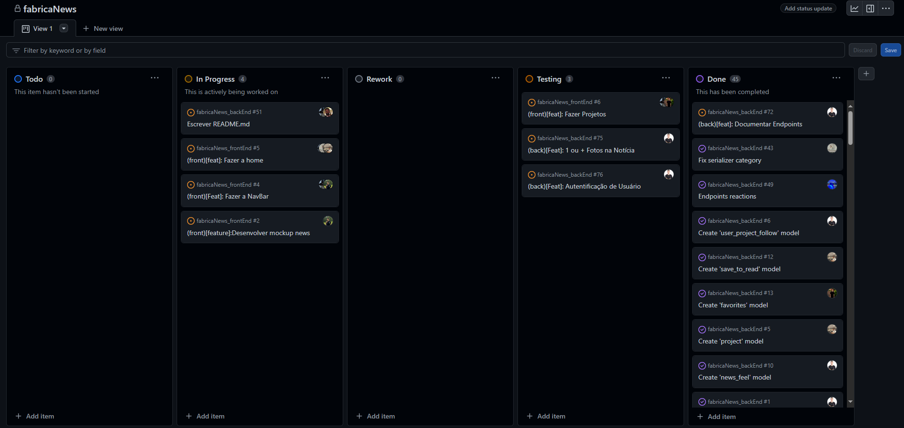

Uma issue, quando finalizada, pode ser fechada com um **Pull Request**.

## Pull Request

Um pull request é uma solicitação de contribuição. Ele é usado para solicitar que as alterações feitas em uma branch sejam mergeadas com a branch desejada, que receberá, de acordo com as regras estabelecidas pela equipe do projeto, as melhorias desenvolvidas pela equipe. Um pull request pode ser revisado, aprovado, recusado, comentado, entre outras ações. Após ser aprovado, o pull request é mergeado com a branch e a issue é fechada automaticamente.


Observe que, na imagem acima, o desenvolvedor está criando um novo `Pull Request` para a branch `development`. O desenvolvedor está informando que a `Issue` #3 foi finalizada e que a branch `feature-3` está pronta para ser mergeada com a branch `development`. O desenvolvedor também está informando que a `Issue` #3 foi finalizada com o título `Refactor #3`.

Também, ao realizar a `Pull request`, o desenvolvedor atribuiu um `Reviewer`, que é a pessoa que fará a revisão do código. Também é possível colocar alguns `labels`, que são como _tags_ para classificar a `Pull request`. Também é possível colocar um `Project` e uma `Milestone` para a `Pull request`, assim como uma `Description`. Se você rolar a página para baixo, verá que é possível visualizar as alterações que foram feitas na branch `feature-3` e que serão mergeadas com a branch `development`. O próprio GitHub detecta as alterações nos documentos, documentos adicionados, mensagens de commit, entre outros. Voltando para a parte superior da imagem, há, ao lado dos nomes das branches envolvidas, uma mensagem `_Able to merge_`. Isso significa que as branches podem ser mergeadas. Se houver algum problema, o GitHub informará que as branches não podem ser mergeadas e informará o motivo.

> As branches poderão ter conflitos ao tentar executar as `Pull requests`. Isso acontece quando duas ou mais pessoas alteram a mesma linha de um arquivo. Digamos que duas anterior a este `Pull request` a branch `development` já havia sido atualizada com as alterações da branch `feature-2`. Agora, a branch `feature-3` também está tentando ser mergeada com a branch `development`. Se houver conflitos, o GitHub informará que as branches não podem ser mergeadas e informará o motivo. O desenvolvedor deverá resolver os conflitos e tentar novamente realizar a `Pull request`.

Como neste caso há a possibilidade de ***mergear*** (isso não existe, é informal - merge é o correto), ou seja, unir os códigos das duas branches, o desenvolvedor poderá clicar no botão `Create pull request`. Após clicar neste botão, o desenvolvedor será direcionado para a página de revisão do `Pull Request`, que corresponde com a imagem abaixo.

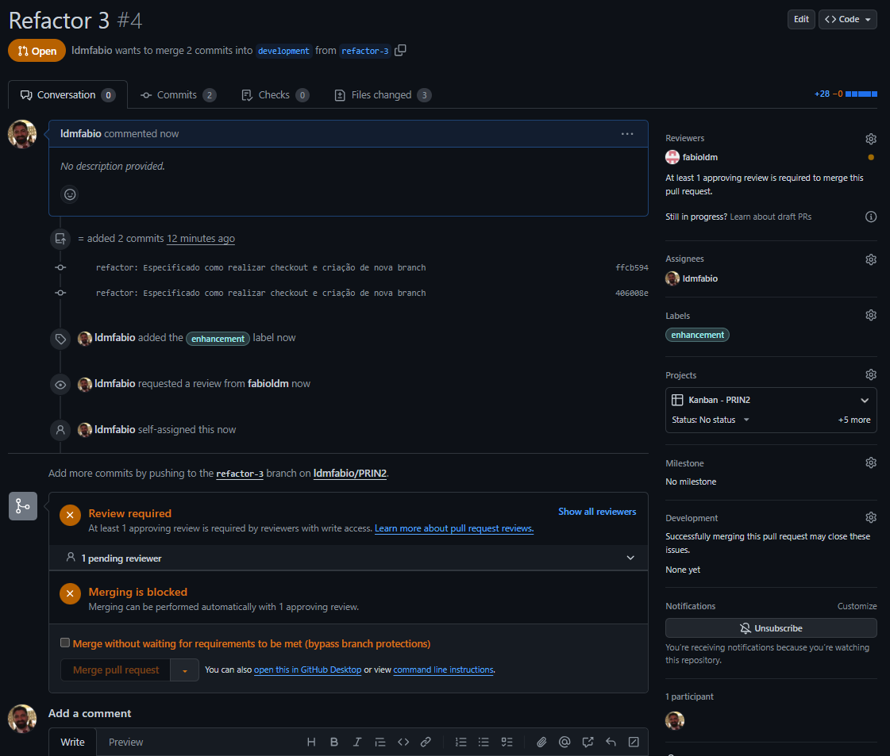

Neste momento não há mais o que o desenvolvedor fazer nesta `Issue`. A próxima evolução que poderá ocorrer aqui dependerá do usuário reviewer, que é o `fabioldm`, que é o usuário que fará a revisão do código. O revisor poderá aprovar, recusar, comentar, entre outras ações. Após ser aprovado, o pull request é mergeado com a branch e a issue é fechada automaticamente.

As imagens que serão apresentadas abaixo demonstram as etapas que seguiram para a realização de uma alteração, que foi feita na branch `feature-3`, e que foi mergeada com a branch `development`. Inclusive, no que respeita a `Issue` #3, que foi finalizada com o título `Refactor #3`, e que foi fechada automaticamente após o merge, a Branch criada, `feature-3`, foi deletada, pois não há mais necessidade de mantê-la ativa. Contudo, ao analisar os commits que foram feitos, observa-se o atendimento do padrão de mensagens de commit, considerando que este foi um `refactor`.

Na imagem seguinte, o usuário `fabioldm` recebeu uma notificação indicando que foi atribuído como revisor do `Pull Request`.

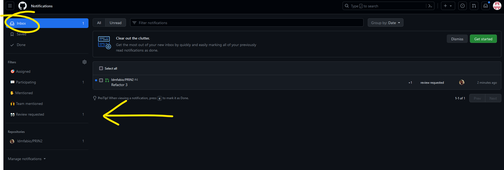

Ao abrir a notificação, o usuário será direcionado para a review do `Pull Request`. Na imagem abaixo, precisamente no canto superior direito há um botão com a mensagem `_Add your review_`.

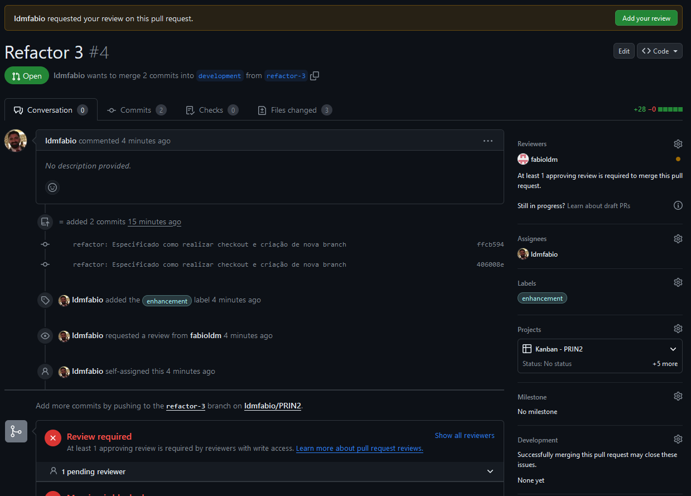

Quando o usuário clicar neste botão, ele será direcionado para a página de revisão do `Pull Request`. Então o GitHub apresentará quais foram as alterações que ele terá de revisar nesta `Pull Request`. Na imagem abaixo, precisamente no canto superior direito há um botão com a mensagem `_Review changes_`.

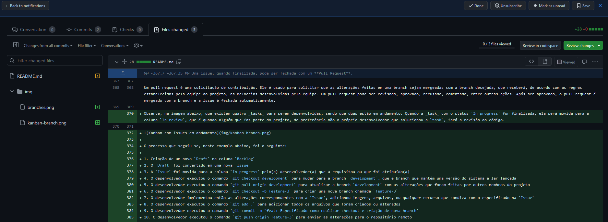

Ao clicar no botão `_Review changes_`, o usuário terá a opção de deixar um comentário apenas, também poderá aprovar a `Pull Request` ou solicitar alterações. A imagem abaixo apresenta em detalhes as opções que o GitHub fornece.

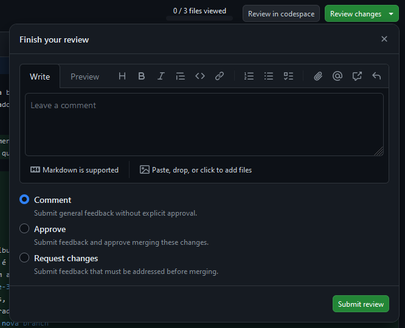

Após tomar a decisão condizente com a análise que foi realizada, o usuário poderá clicar no botão `_Submit review_`. Após clicar neste botão, o GitHub então direcionará o usuário para uma próxima página, mostrando que será possível realizar o merge, ou seja, unir as branches. A imagem abaixo apresenta a mensagem que o GitHub fornece.

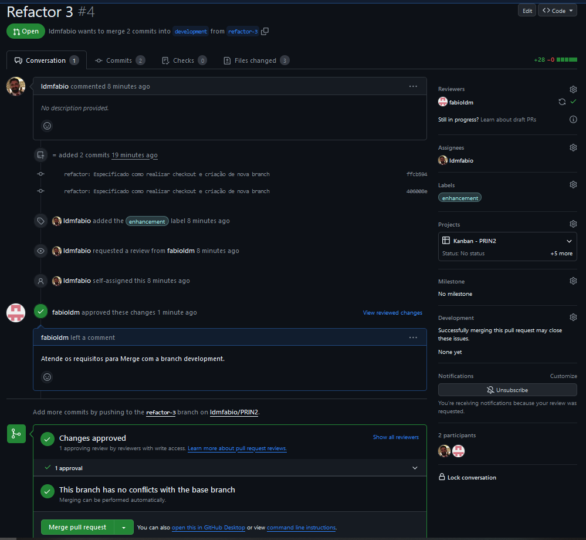

Quando o revisor clicar na opção que está na parte inferior da imagem, com a descrição `Merge pull request`, o GitHub então realizará o merge das branches. A imagem abaixo apresenta a mensagem que o GitHub apresentará para o usuário.

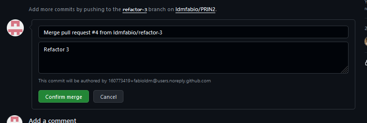

Então, ao confirmar o Merge (`Confirm merge`), o GitHub unirá os códigos das branches. Neste momento a Pull Request será fechada automaticamente. A imagem abaixo apresenta a mensagem que o GitHub apresentará para o usuário.

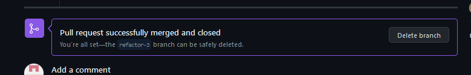

Ficará o registro da exclusão da branch que foi _mergeada_. A imagem abaixo apresenta a mensagem que o GitHub apresentará para o usuário.

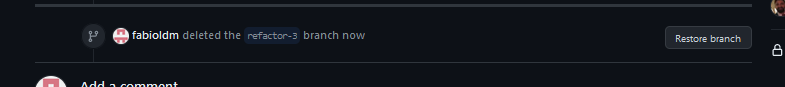

Também vale lembrar que a Issue precisa ser finalizada. Portanto é necessário retornar ao Project e abrir a Issue correspondente com a `Pull Request` que foi fechada. Ao abrir a Issue, o usuário terá a opção de fechar a Issue (`Close issue`). A imagem abaixo apresenta a mensagem que o GitHub apresentará para o usuário.

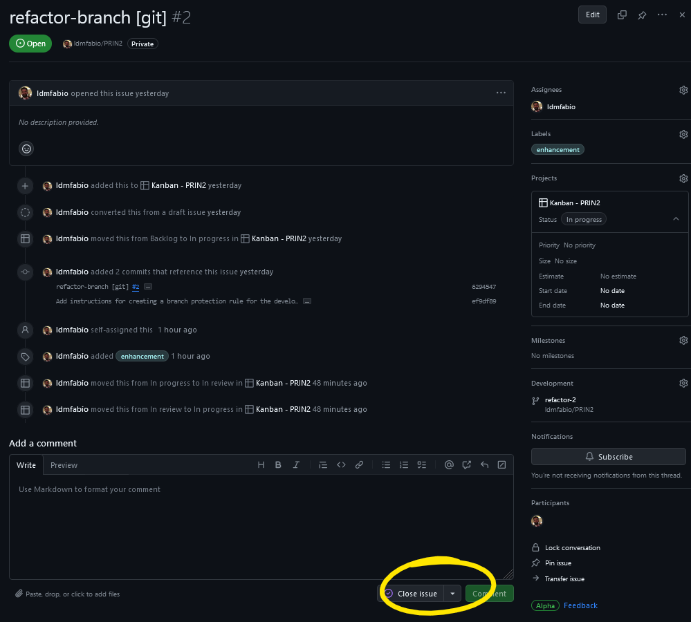

> Nestas etapas demonstradas acima por meio do uso de imagens não houve qualquer conflito entre os códigos que foram mergeados. Os conflitos podem ocorrer quando duas ou mais pessoas alteram a mesma linha de um arquivo, por exemplo. Se houver conflitos, o GitHub informará que as branches não podem ser mergeadas e informará o motivo. O desenvolvedor deverá resolver os conflitos e tentar novamente realizar a `Pull request`. O conflito pode ocorrer da seguinte forma: Dois ou mais desenvolvedores criaram branches à partir da branch `development`. Portanto, se um desenvolvedor fez um `Pull request` para a branch `development` que altere o arquivo `index.html`, e outro desenvolvedor fez um `Pull request` para a branch `development` que altere o mesmo arquivo `index.html`, o GitHub irá detectar que a versão da branch `development` não é a mesma que o segundo usuário possui. Então apresentará os conflitos que existem no arquivo.

> Caso você queira ver como o GitHub apresenta os conflitos na hora de realizar o `Pull request`, [clique aqui](git/conflitos.md).

## Merge

